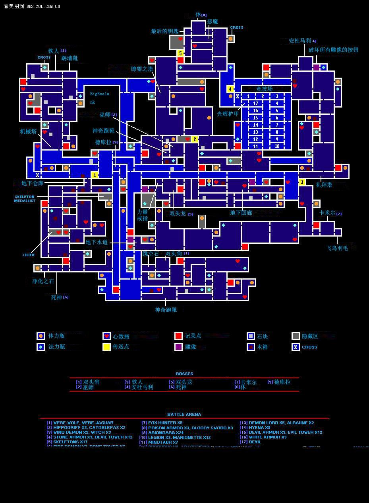
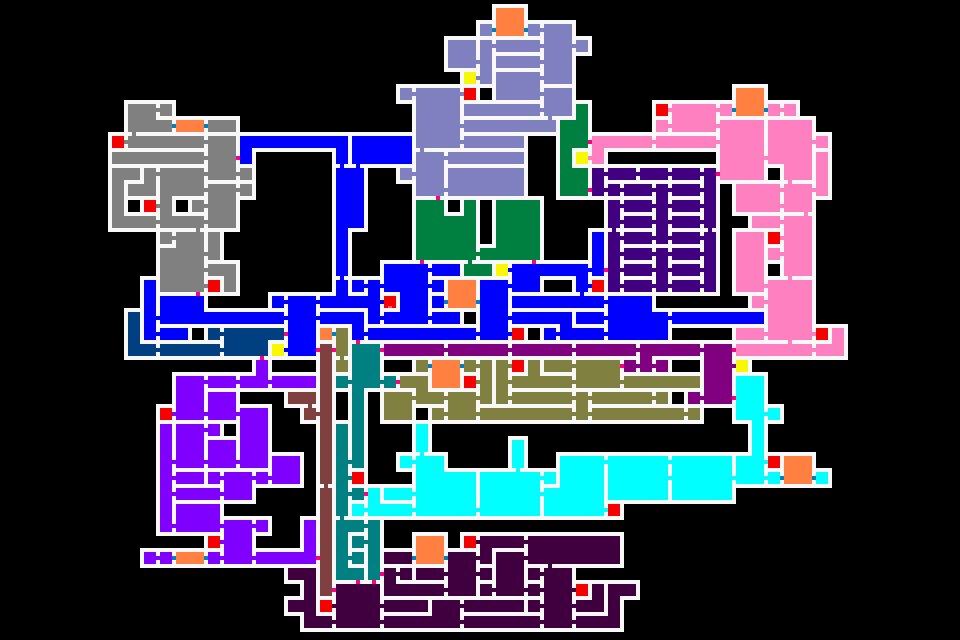

---

#Emulators
- [GBA](GBA.zip) (.zip)
- [DS](DS.zip) (.zip)

#GBA Games
- [Advance Wars](Advance Wars.gba) (.gba)
- [Advance Wars 2 - Black Hole Rising](Advance Wars 2 - Black Hole Rising.gba) (.gba)
- [Yoshi's Island - Super Mario Advance 3](Yoshi's Island - Super Mario Advance 3.gba) (.gba)
- [Castlevania - Circle of the Moon (月下輪舞曲)](Castlevania - Circle of the Moon.gba) (.gba)
- [Castlevania - Harmony of Dissonance (白夜協奏曲)](Castlevania - Harmony of Dissonance.gba) (.gba)
- [Castlevania - Aria of Sorrow (曉月圓舞曲)](Castlevania - Aria of Sorrow.gba) (.gba)

#DS Games
- [Advance Wars - Dual Strike](Advance Wars - Dual Strike.nds) (.nds)
- [Castlevania - Dawn of Sorrow (蒼月的十字架)](Castlevania - Dawn of Sorrow.nds) (.nds)
- [Castlevania - Portrait of Ruin (迷宮的畫廊)](Castlevania - Portrait of Ruin.nds) (.nds)
- [Castlevania - Order of Ecclesia (被奪走的刻印)](Castlevania - Order of Ecclesia.nds) (.nds)

---

#Castlevania - Circle of the Moon

#Castlevania - Dawn of Sorrow
[Weapons](Castlevania - Dawn of Sorrow - Weapons.jpg)

[Map](Castlevania - Dawn of Sorrow - Maps_1.jpg)
